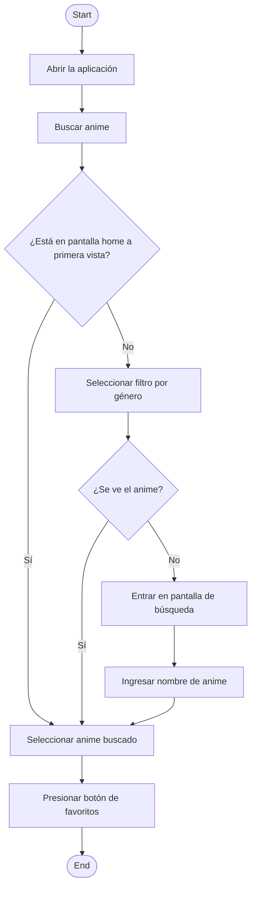
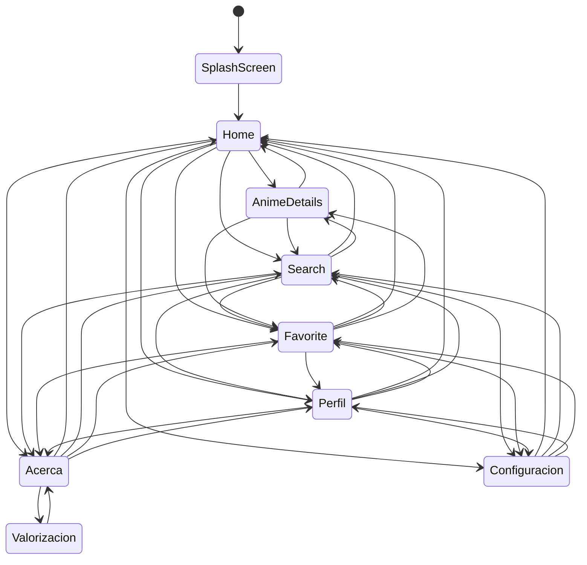

# AnimeGuide

Aplicación móvil desarrollada en Flutter, dirigida a aficionados y a quien quiera informarse antes de comenzar un anime o un manga. Proporciona fichas completas por anime/manga y permitiendo marcar favoritos para seguimiento personal. AnimeGuide no reproduce capítulos; solo ofrece información y enlaces externos para consulta.

## Pantallas y Funcionalidades principales
- **Home** 
    - Sucesion de títulos de anime/manga por categorias, tales como: populares, emision y generos de anime.
    - Listas horizontales de los animes/mangas por cada categorias, junto a la imagen y titulo
    - Preferencias de mostrar anime por genero
- **Search** 
    - Búsqueda en especifico de anime/manga a traves del nombre o mas general a traves del genero.
    - Resultado con miniatura del anime/manga junto al nombre  
- **Favorites** 
    - Lista de animes/mangas agregados a favoritos. 
    - Posibilidad de eliminar de favoritos
- **Perfil**
    -  Configuracion de foto de perfil
    -  Configuracion de nombre de usuario
- **Anime Detail** 
    - Ficha del anime/manga en donde se mostrara una portada grande, título, chips (género · episodios · estado), sinopsis (colapsable), ficha técnica (año, creador, estudio), personajes principales, enlaces externos y botón **Agregar a favoritos**.
- **Configuration**
    - Pantalla de configuracion en la cual se podra configurar el tema con el cual se querra ver la aplicacion, y tamabien se podra configurar el tipo de fuente con el cual se utilizara la aplicacion
- **Acerca de..**
    - Se muestra informacion del desarrollador, como comunicarse con el y cual era la idea general de la aplicacion. A la vez encontrara una seccion en la cual puede valorar en general la aplicacion, junto con          dar unas recomendaciones 
- **SplashScreen** 
    - Pantalla de inicio en donde se muestra el logo de la aplicacion con el nombre de esta, mientras se aparece y desvanece 

## Estructura de ficha de anime
- Portada: imagen principal horizontal.

- Título: nombre del anime/manga.

- Sinopsis: resumen de la serie.

- Datos: genero principal, temporadas, estado, episodios.

- Ficha tecnica: creador, estudio, año de lanzamiento.

- Personajes principales: lista con nombre e imagen del personaje.

- Enlaces: trailer y enlaces para ver/leer.

- Acciones: boton para agregar/remover de favoritos.

## Pila de Tecnología

Cliente: Flutter, Android

## Capturas de pantalla

**Pantalla de Home**

**Pantalla de Search**

**Pantalla de favoritos**

**Pantalla de Perfil**

**Pantalla de Acerca de..**

**Pnatalla de Configuracion**

**Barra de navegacion**
- Home: Pantalla donde se muestran animes
- Search: Pantalla para buscar animes
- Favoritos: Pantalla para mostrar animes favoritos
- Pefil: Pantalla donde se ve el perfil del usuario

**Acceso a pantalla "Acerca de" y "Configuracion"**
- A traves del primer boton se puede acceder a la pantalla "Acerca de" y con el segundo a pantalla de "Configuracion"

## Diagrama de flujo - Caso de uso

Buscar un anime y agregarlo a favoritos

## Diagrama de flujo 

## Link video explicatorio
https://youtu.be/Cts8jx8JwIk
