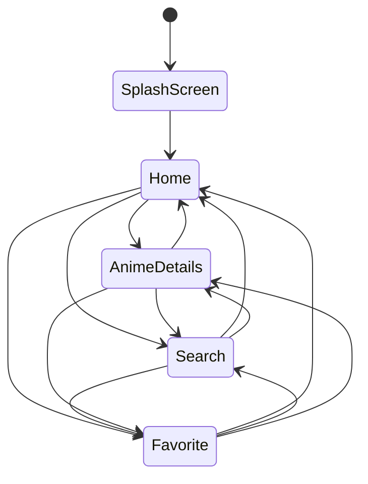

# AnimeGuide

Aplicación móvil desarrollada en Flutter, dirigida a aficionados y a quien quiera informarse antes de comenzar un anime o un manga. Proporciona fichas completas por anime/manga y permitiendo marcar favoritos para seguimiento personal. AnimeGuide no reproduce capítulos; solo ofrece información y enlaces externos para consulta.

## Pantallas y Funcionalidades principales
- **Home** 
    - Sucesion de títulos de anime/manga por categorias, tales como: populares, emision y generos de anime.
    - Listas horizontales de los animes/mangas por cada categorias, junto a la imagen y titulo
- **Search** 
    - Búsqueda en especifico de anime/manga a traves del nombre o mas general a traves del genero.
    - Resultado con miniatura del anime/manga junto al nombre  
- **Favorites** 
    - Lista de animes/mangas agregados a favoritos. 
    - Posibilidad de eliminar de favoritos

- **Anime Detail** 
    - Ficha del anime/manga en donde se mostrara una portada grande, título, chips (género · episodios · estado), sinopsis (colapsable), ficha técnica (año, creador, estudio), personajes principales, enlaces externos y botón **Agregar a favoritos**.
- **SplashScreen** 
    - Pantalla de inicio en donde se muestra el logo de la aplicacion con el nombre de esta, mientras se aparece y desvanece 

## Estructura de ficha de anime
- Portada: imagen principal horizontal.

- Título: nombre del anime/manga.

- Sinopsis: resumen de la serie.

- Datos: genero principal, temporadas, estado, episodios.

- Ficha tecnica: creador, estudio, año de lanzamiento.

- Personajes principales: lista con nombre e imagen del personaje.

- Enlaces: trailer y enlaces para ver/leer.

- Acciones: boton para agregar/remover de favoritos.

## Pila de Tecnología

Cliente: Flutter, Android

